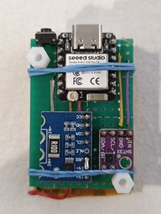
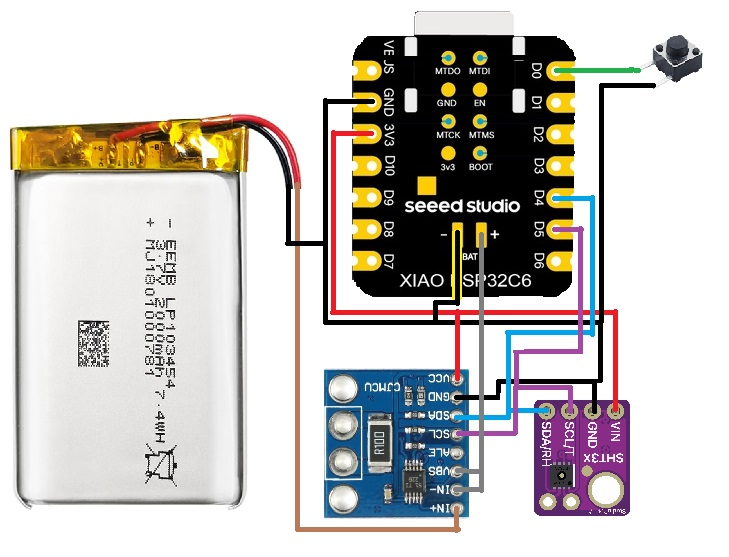

# Zigbee Czujnik Temperatury i Wilgotności z Deep Sleep
# Zigbee Temperature & Humidity Sensor with Deep Sleep

**Wersja / Version:** 1.0  
**Autor / Author:** Maciej Sikorski  
**Data / Date:** 30.03.2026  
**Licencja / License:** Apache 2.0

---

## Opis / Description

Czujnik Zigbee End Device oparty na płytce **Seeed Studio XIAO ESP32C6**.  
Co 10 minut budzi się z deep sleep, mierzy temperaturę i wilgotność (SHT3x) oraz napięcie baterii LiPo (INA226), wysyła dane do sieci Zigbee i ponownie zasypia.

A Zigbee End Device based on the **Seeed Studio XIAO ESP32C6**.  
Every 10 minutes it wakes from deep sleep, measures temperature & humidity (SHT3x) and LiPo battery voltage (INA226), reports to Zigbee network, then sleeps again.

---

## Zdjęcie / Photo

*XIAO ESP32C6 (góra / top) + INA226 (lewy dół / bottom left) + SHT3x (prawy dół / bottom right)*

---

## Cechy / Features

- 🔋 **Efektywny energetycznie / Power efficient:** Deep sleep 10 minut, ~5–6 lat na baterii LiPo 2000 mAh
- 🛡️ **Niezawodny / Reliable:** Retry logic dla czujników, RTC fallback, thread-safe
- 📊 **Monitorowanie baterii / Battery monitoring:** Napięcie + procent rozładowania
- 🌡️ **Dokładne pomiary / Accurate measurements:** SHT3x (±0.3°C, ±2% RH), timeout + walidacja zakresu
- 🔧 **Factory Reset:** Przycisk BOOT (> 3 s) resetuje Zigbee binding
- 📝 **Bilingual docs / Dokumentacja dwujęzyczna:** PL + EN

---

## Sprzęt / Hardware

| Komponent / Component | Model |
|---|---|
| Płytka / Board | Seeed Studio XIAO ESP32C6 |
| Czujnik T/H / T/H Sensor | SHT30 / SHT31 / SHT35 (SHT3x) |
| Monitor baterii / Battery monitor | INA226 |
| Bateria / Battery | Li-Pol / LiPo 3.7V |

---

## BOM (Lista części / Parts list)

| Lp. / No. | Komponent / Component | Model | Ilość / Qty | Źródło / Source |
|---|---|---|---|---|
| 1 | Płytka / Board | XIAO ESP32C6 | 1 | Seeed Studio |
| 2 | Czujnik T/H | SHT31 | 1 | Adafruit / AliExpress |
| 3 | Monitor baterii / Battery monitor | INA226 | 1 | AliExpress |
| 4 | Bateria LiPo | 503450 (500 mAh) / 704050 (2000 mAh) | 1 | AliExpress |
| 5 | Kondensator ceramiczny | 100 nF (dla SHT3x, INA226) | 2 | AliExpress |
| 6 | Rezystor pull-up | 10 kΩ (opcjonalnie / optional) | 2 | AliExpress |

> 💡 Całkowity koszt (~2026): ~25–40 PLN (bez baterii / without battery)

---

## Schemat podłączenia / Wiring diagram

### XIAO ESP32C6 → SHT3x

| XIAO ESP32C6 | SHT3x |
|---|---|
| GPIO22 (SDA) | SDA |
| GPIO23 (SCL) | SCL |
| 3.3V | VCC |
| GND | GND |

> Adres I2C: `0x44` (domyślny / default)

---

### XIAO ESP32C6 → INA226

| XIAO ESP32C6 | INA226 |
|---|---|
| GPIO22 (SDA) | SDA |
| GPIO23 (SCL) | SCL |
| 3.3V | VCC |
| GND | GND |
| BAT+ | VIN- |
| BAT- | GND |

### INA226 → Bateria LiPo / LiPo battery

| INA226 | Podłączenie / Connection |
|---|---|
| VIN+ | (+) baterii LiPo / LiPo (+) |
| VIN- | zwarte z V_BUS / shorted to V_BUS |
| V_BUS | zwarte z VIN- / shorted to VIN- |
| GND | (-) baterii LiPo / LiPo (-) |

> INA226 mierzy napięcie szyny (bus voltage) jako napięcie baterii.  
> INA226 measures bus voltage as battery voltage.

---

### Przycisk BOOT / BOOT button

| XIAO ESP32C6 | |
|---|---|
| GPIO0 | Przycisk → GND / Button → GND |

> Przytrzymaj > 3 sekundy → Factory Reset (miga LED)  
> Hold > 3 seconds → Factory Reset (LED blinks)

---

## Instalacja / Installation

### Krok 1: Arduino IDE + pakiet ESP32 / Step 1: Arduino IDE + ESP32 package

1. `File → Preferences → Additional Boards Manager URLs` — dodaj / add:
